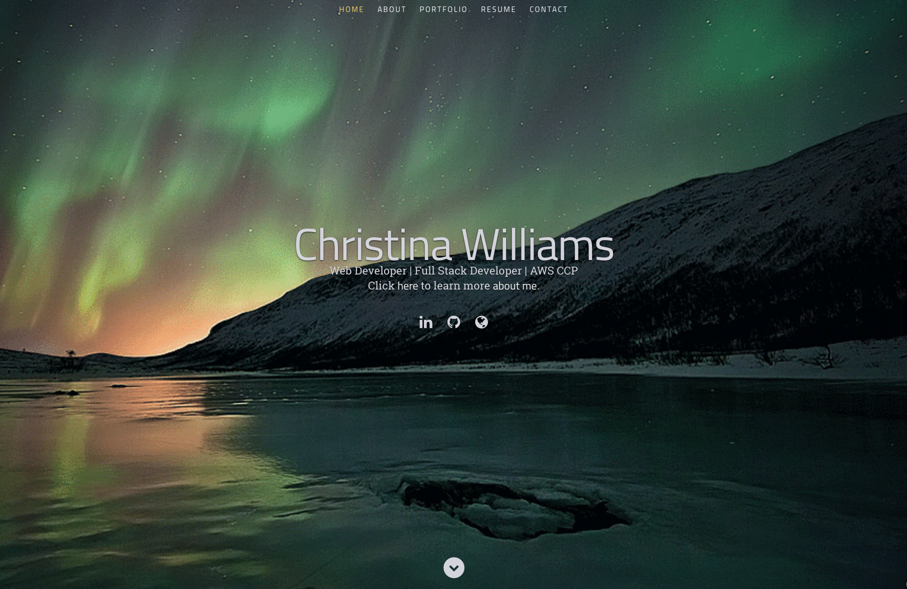
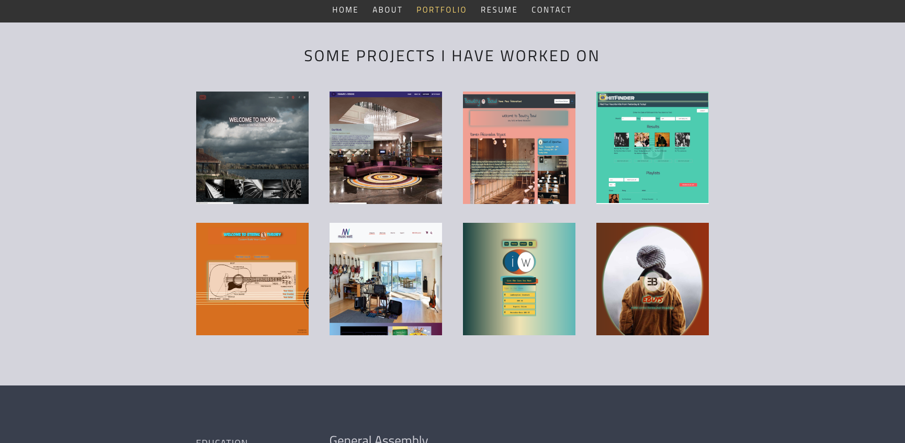
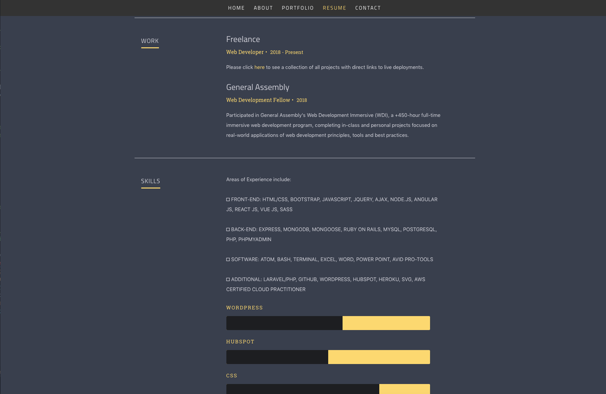
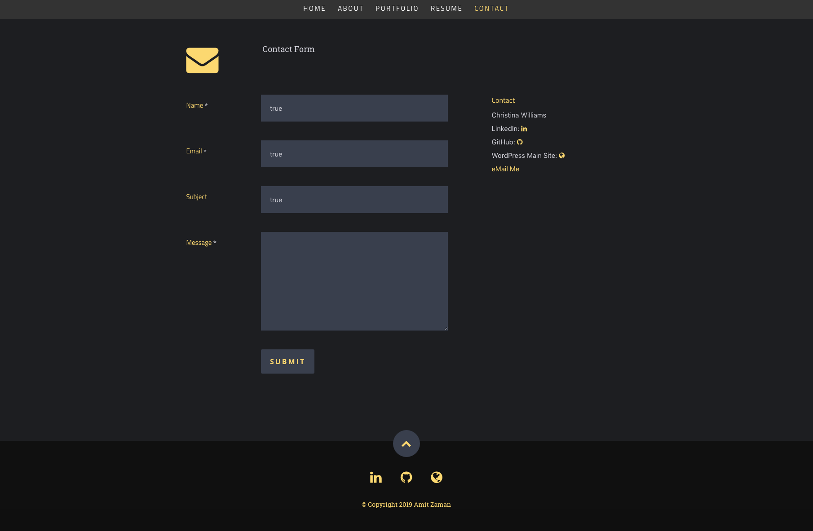

# [Sample Portfolio Site Made With REACT JS](https://amit-react-portfolio.herokuapp.com/)
#### Please Click Link Above to View Live Heroku Deployment.

##### A Sample resume/portfolio site made with REACT JS and can be viewed [here](https://amit-react-portfolio.herokuapp.com/).

 

  

  
  
  
  

#### To view the site's Heroku deployment, click the name/link on top of this page or you can view [here](https://amit-react-portfolio.herokuapp.com/).

##### [Amit](https://amitzaman.com/)

_______________________________________________________________________________

This project was bootstrapped with [Create React App](https://github.com/facebook/create-react-app).

## Available Scripts

In the project directory, you can run:

### `npm start`
